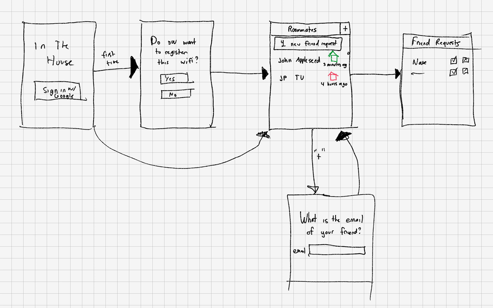

# Vision and Scope

"In The House" will allow users to add friends and accept requests to track whether or not friends are home. Users can open the app to see which of their friends are home. The information will be displayed to the user through an Android app. 

This app is intended to be used by people who have roommates or live with family members. It will allow users to avoid the uncomfortable text messages asking if someone is home. It won't tell you the user's exact location, but will let you know if they are home.

# Low Fidelity Prototype

# REST API

We are going to build out a RESTful API using Python and Flask. It will use Mongo DB to store information about user's previous location check-ins and will utilize a third-party SSO service to authenticate users. This will be hosted in Amazon EC2 for use with the app.

The resources we will use is that the API will need to facilitate:

1. Checking in as being home.
2. Sending a friend request.
3. Accepting a friend request.
4. Deleting a friend.
5. Pulling the Home Status of accepted friends.
6. Registering a home wifi.